# 🚀 WordPress Docker Stack
### WordPress + MySQL + Redis using Docker Compose


---

## 📚 About This Project / TechStack

Project ini menjalankan **WordPress CMS menggunakan Docker Compose** dengan tiga container:

- WordPress
- MySQL
- Redis

Tujuan project ini adalah memahami konsep:

- Multi-container Docker
- Docker networking
- Volume persistence
- Service dependency (`depends_on`)
- Redis caching

---


## 📦 Services

| Service   | Description            |
| --------- | ---------------------- |
| WordPress | Web CMS                |
| MySQL     | Database               |
| Redis     | In-memory cache system |

---

## ⚙️ Cara Menjalankan Project

### 1. Clone / Masuk Folder Project

```bash
cd wordpress
```

### 2. Jalankan Docker

```bash
docker-compose up -d
```

### 3. Cek Container

```bash
docker ps
```

---

## 🌐 Akses WordPress

Buka browser:

```
http://localhost:8000
```

---

## 📸 Dokumentasi Screenshot

### 🔹 Docker Installation Step Running
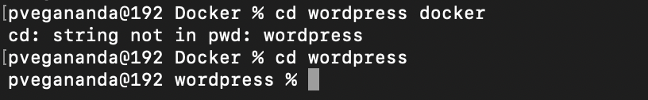
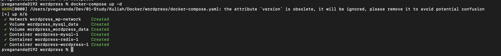

### 🔹 Docker Containers Running

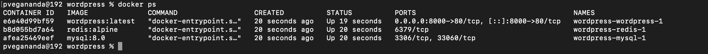

### 🔹 WordPress Installation Page

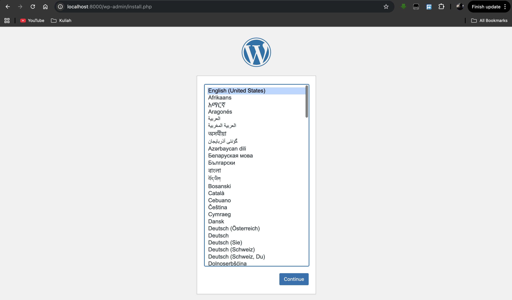
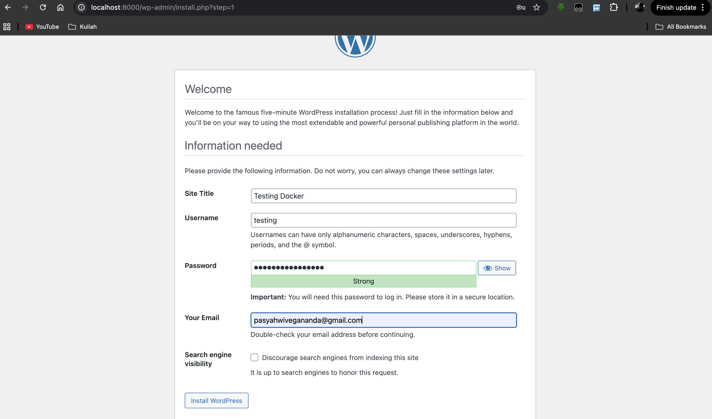


### 🔹 WordPress Dashboard

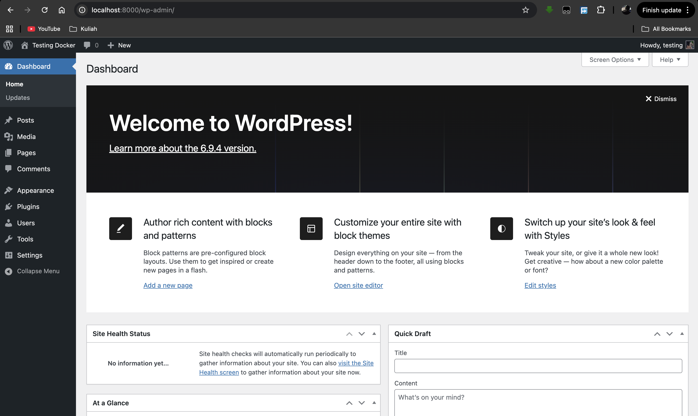

### 🔹 Redis Install Setup

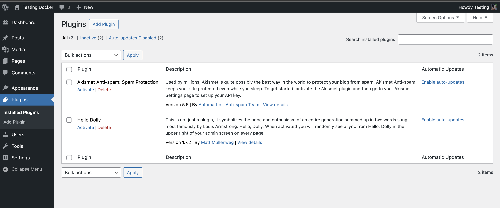
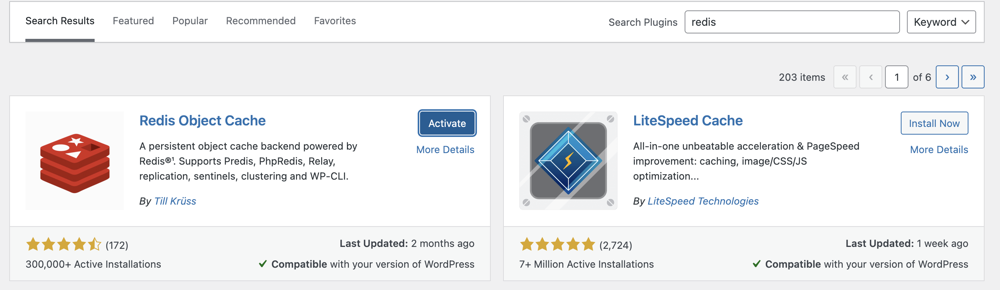
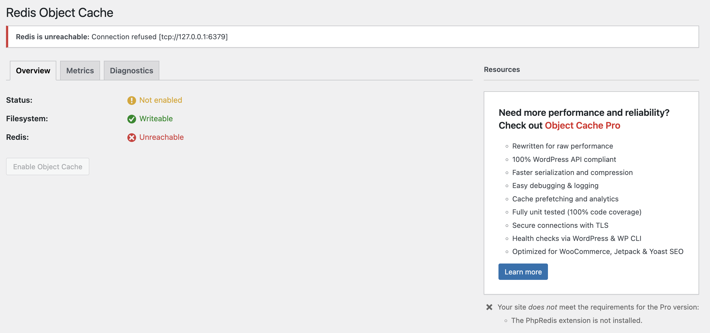
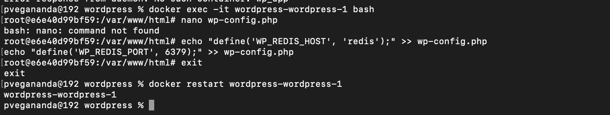

### 🔹 Redis Ping Test

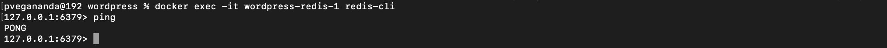

### 🔹 Redis Connected

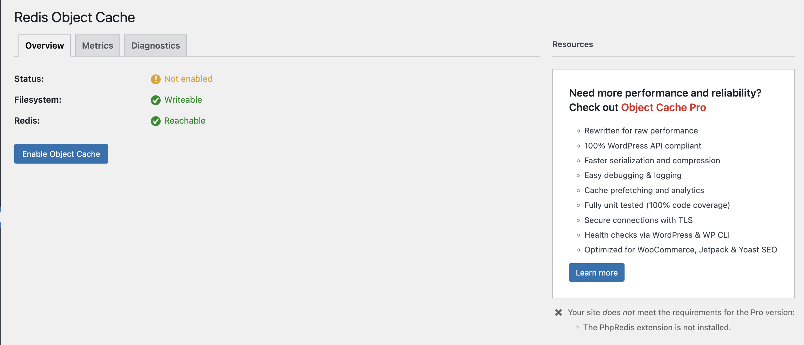

---

## 💾 Data Persistence

MySQL menggunakan volume:

```yaml
volumes:
  - mysql_data:/var/lib/mysql
```

Tujuan:

* Data tidak hilang saat container restart

---

## 🔗 Redis Integration

WordPress dikonfigurasi menggunakan:

```php
define('WP_REDIS_HOST', 'redis');
define('WP_REDIS_PORT', 6379);
```

---

## ❓ Jawaban Pertanyaan

### 1. Kenapa perlu volume untuk MySQL?

Volume digunakan agar data database tetap tersimpan walaupun container dihentikan atau dihapus (bersifat permanen) jadi jika tanda adanya volume otomatis setiap container di buat ulang database akan terhapus. 

---

### 2. Apa fungsi depends_on?

Untuk mengatur urutan startup antar service, contoh: WordPress menunggu MySQL berjalan terlebih dahulu karena kalau terbalik jelas akan error :D

---

### 3. Bagaimana WordPress connect ke MySQL?

Menggunakan environment variables:

* WORDPRESS_DB_HOST 
* WORDPRESS_DB_USER
* WORDPRESS_DB_PASSWORD
* WORDPRESS_DB_NAME

untuk isi dari variables di atas menyesuaikan database di local masing - masing :D

---

### 4. Apa keuntungan pakai Redis?

* Mempercepat loading website
* Mengurangi query database
* Meningkatkan performa

yang paling utamanya redis digunakan sebagai sistem cache jadi data yang sering di akses pengunjung ke sebuah website pasti akan tersimpan di memori sehingga lebih cepat dalam load sebuah website 
---

## ✅ Status

✔️ All containers running
✔️ WordPress accessible
✔️ Redis connected
✔️ Data persistence working

---

## 👨‍💻 Author

Pasyah Vegananda 🚀
